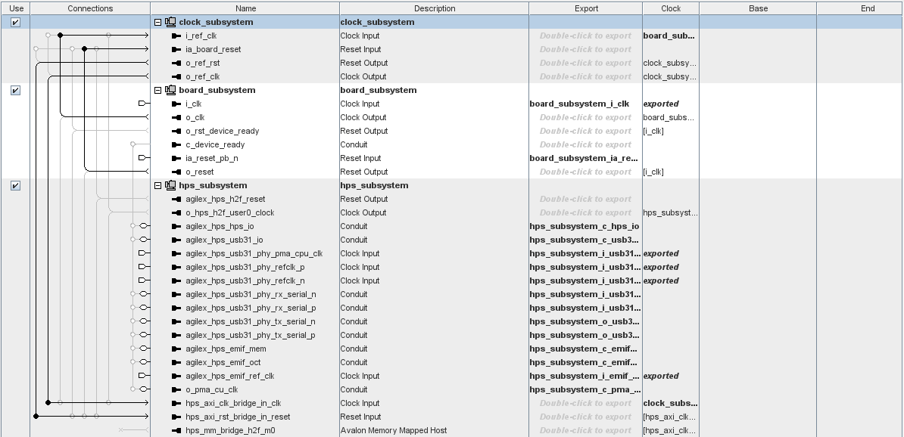
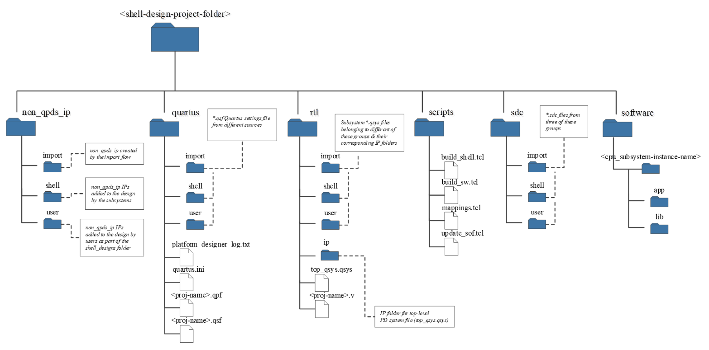
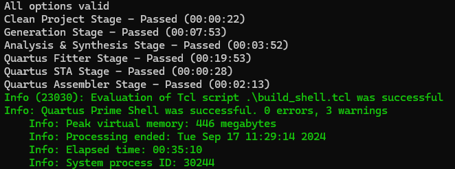
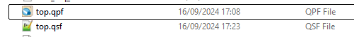
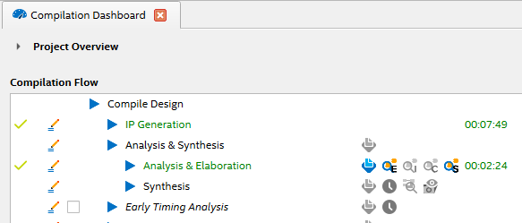

# Modular Design Toolkit (MDT) for Altera® Design Examples

## Overview

The Altera® Modular Design Toolkit simplifies the creation of designs for the Platform Designer
(PD) tool included with the Altera® Quartus® Prime software. The toolkit provides a framework
to assemble complete FPGA designs from a library of subsystems. “Subsystem” is a PD term
describing a subgroup of IPs connected to each other within a larger system of subsystems and
individual IPs. A Modular Design is a collection of subsystems targeting a specific hardware
configuration. This modular design framework allows you to quickly target a particular board
as they include the subsystems necessary for the board IO. The goal of the Modular Design
Toolkit approach is to create modular designs from existing subsystems & IP in a consistent
manner and reduce the time to create new designs.

The Modular Design Toolkit provides support for the following:

- Library of subsystems: A set of pre-defined subsystems using Altera® IP components.
- Creation of custom subsystems: Define and reuse custom parameterizable subsystems in a
  Subsystem Definition File that describes IP components, connectivity, and interfaces.
- Project creation and build: Automated creation and build of a full Quartus® project and
  folder hierarchy.

### Software Requirements

This release of the Modular Design Toolkit requires the following software and versions (in Linux):

- Altera® Quartus® Prime Pro version (24.3 or above), including open-source tools to
   compile software targeting NiosV soft-processors.
- Altera® VIP Suite version 24.3 - (optional – only needed for designs with video
   processing IP from Altera® VIP suite)

### Hardware Requirements

To operate modular systems on hardware, ensure you have the suitable board or development kit that is
compatible with your chosen `board_subsystem`. Additionally, you may need relevant accessories such as
daughter cards and other components.
<br><br>

## Getting Started

### Create your own design with an XML description file

The Modular Design Toolkit allows you to create and build designs through the use of a TCL
script and an XML file.

- To get started with a simple design clone the repository:

```bash
   cd <workspace> 
   git clone -b <TAG> https://github.com/altera-fpga/modular-design-toolkit.git modular_design_toolkit
   mkdir my_design
   cd my_design
   vi my_design.xml
```

   A typical XML design description file can look like this.

```xml
    <PROJECT name="top">
        <DEVKIT>AGX_5E_Modular_Devkit</DEVKIT>
        <FAMILY>Agilex 5</FAMILY>
        <DEVICE>A5ED065BB32AE6SR0</DEVICE>
        <VERSION>24.1</VERSION>
        <SUBSYSTEM type="clock" name="clock_subsystem">
            <NUM_GEN_CLOCKS>0</NUM_GEN_CLOCKS>
        </SUBSYSTEM>
        <SUBSYSTEM type="debug"></SUBSYSTEM>
        <SUBSYSTEM type="board" name="board_subsystem">
        </SUBSYSTEM>
        <SUBSYSTEM type="hps" name="hps_subsystem">
            <AVMM_HOST>
                <NAME>hps_subsystem</NAME>
            </AVMM_HOST>
            <H2F_EXPORT>FULL</H2F_EXPORT>
        </SUBSYSTEM>
    </PROJECT>
```

The XML file describes a project that is assembled from subsystems available in the
“subsystems” directory. These are predefined subsystems that you can use to create a
variety of projects. You can add and create your subsystems if required. In this
example, the project contains the following characteristics:

- **PROJECT name**: by default **"top"** (recommended)
- **DEVKIT**: Development Kit name. Available boards can be found at "platform_designer_subsystems/board_subsystem/boards" in this case
  **"AGX_5E_Modular_Devkit"** or [Agilex™ 5 FPGA E-Series 065B Modular Development Kit](https://www.intel.com/content/www/us/en/products/details/fpga/development-kits/agilex/a5e065b-modular.html)
- **DEVICE**: must be a valid device within the Development Kit.
- **clock_subsystem**: does not generate any additional clock other than the available default board oscillator
- **board_subsystem**: baseboard pin assignments and configurations.
- **hps_subsystem**: an instance of the Agilex5 Hard Processor Subsystem with supporting
  HW (such a DDR4 EMIF for Modular Devkit onboard RAM). The property H2F_EXPORT specifies
  that the project should export a Platform Designer top-level interface for the full
  HPS-to-FPGA (H2F) bridge (the Lightweight bridge can also be exported by setting
  this property to "BOTH").

- To create the Quartus® Project for your design, execute:

```bash
   cd ..
   quartus_sh -t ./modular_design_toolkit/scripts/create/create_shell.tcl -xml_path ./my_design/my_design.xml -proj_path <project> -o
```

   Option **"-help"** list out all possible options provided by the create script.

```bash
   quartus_sh -t ./modular_design_toolkit/scripts/create/create_shell.tcl -help
```

The Altera® Quartus® project file is located at ./\<project>/quartus/top.qpf and the
Altera® Platform Designer file is located at ./\<project>/rtl/top.qsys. A typical
top-level PD system looks like this with individual subsystems instantiated in it.



The created folder structure under the project directory (\<project>) is the following:



### Build your design

The following steps show you how to compile the design created in the step above.
Two flows are described.  Automated/scripted compilation and compilation using
the Platform Designer and Quartus® GUIs.

#### **a. Automated Compilation**

- In a terminal, navigate to \<project>/scripts and type the following command:

```bash
   cd <project>/scripts 
   quartus_sh -t build_shell.tcl <build-options>
```

- Option **"-help"** list out all possible options provided by the build script.

```bash
   cd <project>/scripts 
   quartus_sh -t build_shell.tcl -help
```

- The exact build command needed to generate the relevant FPGA programming files
  is given below.

```bash
   cd <project>/scripts 
   quartus_sh -t build_shell.tcl -hw_compile
```



#### **b. Quartus® GUI Compilation**

- In a windows explorer, navigate to \<project>/quartus and double click on
  the file top.qpf (if you named your project "top").



- Once Quartus® Prime opens, in the "Compilation Dashboard" press "Compile Design"
  (or instead navigate to Processing -> Start Compilation in the top menu).



From either method, once the compilation is finished a new FPGA programming file will be generated under \<project>/quartus/output_files.

<span style="color:red">**Note:**</span> **this example contains an instance of the Agilex5 HPS, to boot you need to create an RBF/JIC file pair and an SD card image. Please refer to the Linux Build Examples in this [link](https://altera-fpga.github.io/rel-24.3/embedded-designs/agilex-5/e-series/modular/boot-examples/ug-linux-boot-agx5e-modular/) or the GSRD User Guide in this [link](https://altera-fpga.github.io/rel-24.3/embedded-designs/agilex-5/e-series/modular/gsrd/ug-gsrd-agx5e-modular/).**
<br><br>

## Repository Structure

The diagram below summarizes the contents of the Modular Design Toolkit (MDT)

        modular-design-toolkit
                    |--------- scripts
                    |                |------------build
                    |                |                    |-----packages
                    |                |------------create
                    |                                      |-----packages
                    |
                    |---------subsystems
                           |----------platform_designer_subsystems
                           |                     |----board_subsystem
                           |                     |----  (…)
                           |                     |----top_subsystem
                           |
                           |----------custom_user_subsystems
                           |                      |----drive_subsystems
                           |                      |----  (…)
                           |                      |----agx5_motor_model_subsystem
                           |
                           |------------------common/non_qpds_ip
                                                  |----*fpga*ip

The next table describes the contents of the repo.

| Directory Name     |   Sub-Directory                                   | Description   |
| ---                |   ---                                             | ---           |
| scripts            |                                                   | Contains the TCL scripts required for the Modular Design Toolkit to function.  The function of these scripts is described in later sections of this document.|
|                    |  create                                           | A collection of TCL scripts and packages to create modular designs based on available subsystems in this repo.|
|                    |  build                                            | A collection of TCL scripts and packages to build and compile modular designs in this repository. This directory is copied into the "project" directory generated in the "creation" phase.|
| Subsystems         |                                                   | Available subsystems to use as "building blocks" for any designs. Divided into "Platform Designer Subsystems" and "Custom User Subsystems". |
| Subsystems         | platform_designer_subsystems                      | Subsystems with Platform Designer Components. |
|                    | platform_designer_subsystems/board_subsystems     | TCL Subsystem description and collateral to target Development Kits Basic pin assignment, components and configuration files.<br> -Available boards: <br> [Agilex™ 5 FPGA E-Series 065B Modular Development Kit](https://www.intel.com/content/www/us/en/products/details/fpga/development-kits/agilex/a5e065b-modular.html) |
|                    | platform_designer_subsystems/clock _subsystems    | Subsystem to enable/add clocking to the project. |
|                    | platform_designer_subsystems/cpu_subsystem        | Subsystem to enable/add embedded CPU and supporting HW to the project. <br> Available variants: <br> - NiosV/g Subsystem for Drive-On-Chip. |
|                    | platform_designer_subsystems/debug_subsystem      | Probe interfacing for debugging. |
|                    | platform_designer_subsystems/hps_subsystem        | Subsystem to enable/add Hard Processor System and supporting HW to the project. <br> Available variants: <br> - Agilex 5E HPS. |
|                    | platform_designer_subsystems/top_subsystem        | Subsystem to enable/add top-level Verilog files to the project. |
|                    | custom_user_subsystems                            | Available Subsystems based on custom RTL to use as "BUILDING BLOCKS" for any designs. |
|                    | custom_user_subsystems/agx5_motor_model_subsystem | Motor Model Subsystem based on the characteristics of Tamagawa TS4747N3200E600 motor. RTL and HW files are products of the DSP Builder Advanced compilation targeting Agilex5 of the model "setup_motor_kit_sim_20MHz.m" |
|                    | custom_user_subsystems/drive_subsystems           | A collection of subsystems IP and Software for motor control designs. |
|                    | custom_user_subsystems/safety_subsystems          | A collection of subsystems and custom IP for Drive-On-Chip with Safety Function design examples based on speed monitoring and Agilex devices |
|                    | common/non_qpds_ip                                | General-use custom IPs. |
